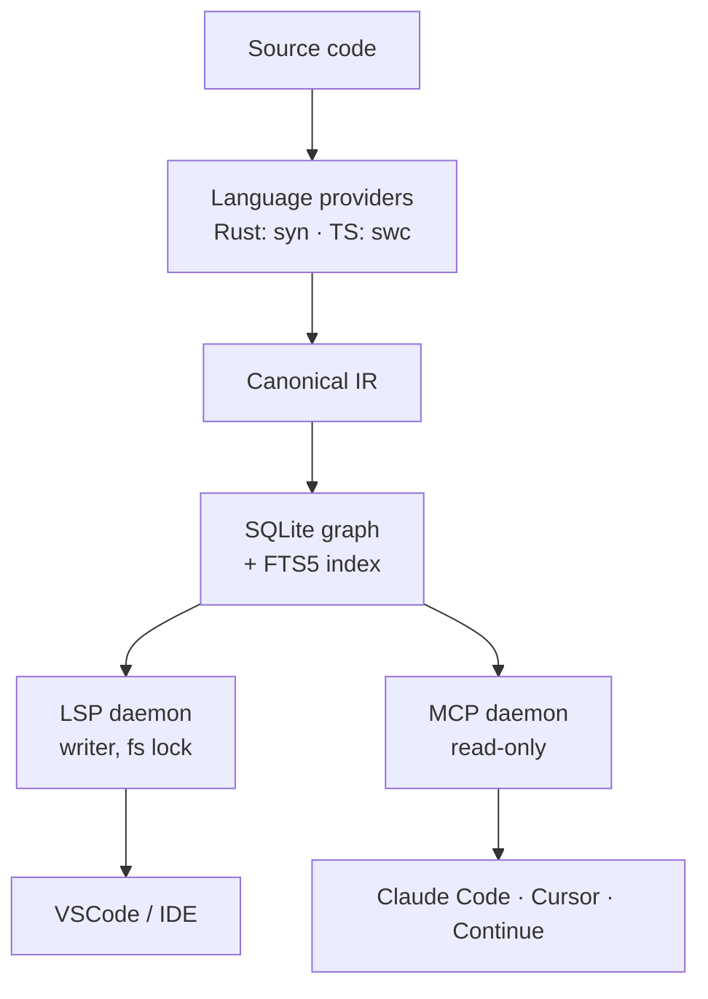

# Standardoc

   

> A semantic code intelligence layer for humans and AI agents.
> Your AST, indexed and queryable — so AI agents stop grepping.

📖 English · [Français](README.fr.md)

[About](ABOUT.md) · [Quickstart](QUICKSTART.md) · [Roadmap](TODO-LIST.md) · [Comparison](COMPARISON.md) · [FAQ](FAQ.md) · [Support](SUPPORT.md) · [Changelog](CHANGELOG.md)

---

## 🧠 What is Standardoc?

Standardoc transforms your code into a **structured, queryable knowledge graph** —
language ASTs are normalized into a canonical IR, indexed live, and exposed
through MCP and LSP.

AI agents stop guessing. They query.

```
Code → Language Providers → Canonical IR → SQLite Graph → MCP / LSP → Humans + AI
```

---

## 🚀 What it enables

- **AI agents query structure** — `find_symbol("createUser")` then `get_context(fqdn, depth=1|2)`. ~100 tokens instead of 30k of `grep + read`.
- **Cross-language graph** — Rust ↔ TypeScript edges (CALLS / IMPORTS / EXTENDS / IMPLEMENTS / …) resolved automatically.
- **Live index** — file watcher keeps the graph in sync; no rescan dance.
- **Local-first** — SQLite under `.standardoc/`, no SaaS, no telemetry.

---

## 📦 Install

> [!WARNING]
> Official binaries are distributed only through GitHub Releases and official editor marketplaces.
> Always verify the repository owner before downloading binaries.

**Rust toolchain** (CLI + MCP + LSP daemon, single binary `stdoc`) :

```sh
cargo install standardoc-cli
stdoc --version
```

**VSCode extension** (auto-spawns the daemon, registers MCP for Claude Code in VSCode + Copilot Chat) :

Search "Standardoc" in the VSCode Extensions panel, or grab the latest VSIX from
[releases](https://github.com/miralabs-tech/standardoc/releases). On first activation
you get an **Initialize this workspace?** prompt — opt in to write `.mcp.json`,
generate the AI agent skill, and start the daemon.

See [QUICKSTART.md](QUICKSTART.md) for the full 5-minute walkthrough.

---

## 🤖 AI agent skill

When you initialize a workspace, Standardoc writes
`.claude/skills/standardoc/SKILL.md`. Claude Code auto-loads it and the AI uses
Standardoc as the **first reflex** for any code task — `find_symbol` /
`get_context` before `Read` / `Grep` / `Glob`.

The skill pre-approves the two MCP tools so they run without per-call permission
prompts. Re-run `Standardoc: Regenerate AI agent skill` from the VSCode command
palette to refresh after upgrades.

---

## 📊 Architecture



The LSP daemon is the **primary writer** (acquires the workspace fs lock, runs
the indexer). MCP daemons run `--readonly` and share the SQLite index
concurrently — no contention.

---

## 🎯 Scope & roadmap

Beta.1 focuses on **Rust + TypeScript** with a single binary `stdoc`, a
file watcher, and 2 honest MCP tools. Documentation rendering (MDX/React),
additional languages, and cross-language bridges land in later milestones.

→ See [TODO-LIST.md](TODO-LIST.md) for the full per-version checkbox roadmap.

---

## 💡 Philosophy

- Code is the source of truth
- Structure is derived
- Understanding is a system

[Read the long form →](ABOUT.md)

---

## 🧩 Open-core posture

**Standardoc Core** *(this repo)* — CLI, LSP, MCP, language providers, VSCode
extension. **[FSL-1.1-MIT](LICENSE)** — converts to **plain MIT on
April 26, 2028**. Free for any non-competing use today, fully MIT after that.

The focus stays on the open-source Core. As long as Standardoc has no
cloud/server component that would justify recurring infrastructure, there
is **no reason to offer a subscription** — and none is planned. If a
companion tool ever ships (e.g. a GitBook-style local doc UI that runs
on your machine, no hosting), it would ship under a **one-time lifetime
license**. Either way, the Core stays OSS and the MIT conversion date
above is locked.

---

## ❤️ Support

If Standardoc helps you rethink how software is understood :

👉 [Star the repo](https://github.com/miralabs-tech/standardoc) · [OpenCollective](https://opencollective.com/standarx) · [Other ways](SUPPORT.md)

---

## 📜 License

[**FSL-1.1-MIT**](LICENSE) — Functional Source License v1.1 with MIT future
license. Each release converts to plain MIT on its second anniversary; the
first release converts on **April 26, 2028**.
